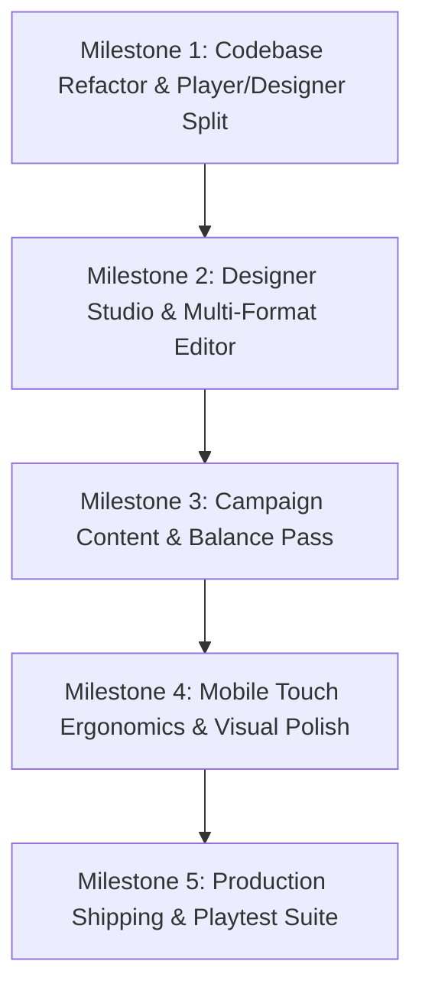

# GeoChain Product Roadmap: From Prototype to Shipped Game

This roadmap outlines the systematic transformation of **GeoChain** from an arcade prototype into a commercial, multi-platform casual puzzle-action title.

---

## 🎯 High-Level Vision & Objectives
1. **Laser-Focused Player Experience:** Clean, distraction-free campaign progression with tight difficulty curves, satisfying 3-star mastery, and competitive per-level leaderboards.
2. **Powerful Designer Studio (Level Editor):** An in-browser authoring suite supporting multi-format parity (Desktop 16:10 $\leftrightarrow$ Mobile 9:16 portrait), live simulation playtesting, and JSON level pack synchronization.
3. **Rock-Solid Foundation:** Modular clean architecture, 120 FPS performance budget, comprehensive documentation, and seamless Vercel distribution.

---

## 🗺️ Milestone Breakdown

---

### 📦 Milestone 1: Codebase Modularization & Player/Designer Split
* **Goal:** Separate the player runtime from developer tooling and remove prototype clutter.

1. **Modular Engine Architecture (`/src`):**
   * `/src/engine/` — Core geometry physics, collision math, elastic grid, particle pools, and Web Audio synth.
   * `/src/player/` — Player campaign loop, star calculation, scorecard modals, and Hall of Fame leaderboards.
   * `/src/editor/` — Designer Studio UI, property inspectors, canvas viewport emulators, and serializer.
   * `/src/data/` — Campaign level definitions and schemas (`levels.json` / `levels.js`).
2. **Player Version Streamlining:**
   * Remove legacy prototype tabs (**Endless Zen**, **Chaos**, **Sandbox Lab**) from the player UI.
   * Deliver a focused HUD: Stage Number, Quota Tracker, Spark Charges, Score, and Chain Combo.
   * Polish modal transitions (Level Selector, Victory Scorecard, Top 10 Comparison).
3. **Multi-Page Entrypoints:**
   * `/index.html` — The official Player Build.
   * `/editor.html` — The Designer Studio & Level Creator.

---

### 🎨 Milestone 2: Designer Studio & Multi-Format Level Editor
* **Goal:** A comprehensive authoring suite to craft, calibrate, and balance campaign stages.

1. **Multi-Format Viewport Emulator:**
   * **Desktop Mode (16:10 / 16:9):** Wide arena preview with fixed aspect bounds.
   * **Mobile Mode (9:16 Portrait):** Tall arena preview simulating phone screen ergonomics.
   * **Density Scaling Engine:** Automated scaling formulas that compute equivalent particle speed and blast radius to preserve gameplay feel and mean free path across both aspect ratios.
2. **Level Property Inspector:**
   * **Stage Identity:** Level number, title, contextual hint banner text.
   * **Entity Palette & Distribution Sliders:**
     * Spark Triangles (`standard`)
     * Heavy Diamonds (`mega`)
     * Nova Stars (`splitter`)
     * Hex Singularities (`vortex`)
     * Ember Pentagons (`longburner`)
     * Delta Chevrons (`speedster`)
     * Catalyst Octagons (`catalyst`)
   * **Physics Calibration:** Base particle velocity slider with player-facing tempo tag preview.
   * **Starting Spark Charges:** 1 or 2 initial triggers.
   * **Automated Star Threshold Calculator:** Auto-computes 1★, 2★, and 3★ quotas based on board particle density and velocity curves.
   * **Par Time Calculator:** Sets target speed bonus duration based on arena dimensions and velocity.
3. **In-Editor Live Simulation Sandbox:**
   * **Instant Playtest Mode:** Click-to-test directly inside the editor viewport without leaving the studio.
   * **Quick Reset Button (`R` key):** Instantly respawns the exact particle layout with a new random seed.
   * **Live Reaction Telemetry:** Real-time feedback showing total exploded bodies, longest chain, percolation coverage percentage, and clear rating.
4. **JSON Serialization & Level Pack Management:**
   * **Export Level JSON:** 1-click clipboard copy / file download of level configuration.
   * **Import & Tune:** Load any existing campaign level into the editor for adjustments.
   * **Draft Autosave:** Local storage backup to ensure unsaved editor work is never lost.

---

### ⚖️ Milestone 3: Campaign Content & Balancing Pass
* **Goal:** Author and balance a complete 15–20 level campaign using the new Level Studio.

1. **Chapter 1: The Basics (Levels 1–4):** High-speed, high-encounter onboarding teaching basic spark timing and diamond blast zones.
2. **Chapter 2: Tactical Chainers (Levels 5–8):** Moderate speeds introducing Nova shard snipers, Gold Ember anchor bridges, and Hexagon gravitational wells.
3. **Chapter 3: The Drift Masters (Levels 9–14):** Slower velocities requiring double-spark initial setup and active mid-cascade combo bridging.
4. **Chapter 4: Supernova Grandmaster (Levels 15–18):** Low-speed precision puzzle stages with multiple catalysts and dense geometric swarms.

---

### 📱 Milestone 4: Mobile Touch Ergonomics & Polish Pass
* **Goal:** Ensure flawless mobile touch controls and premium visual presentation.

1. **Mobile Touch Handling:**
   * Touch event normalization (eliminating 300ms click delay).
   * Pulsing touch reticle ring indicating ignition point.
   * Viewport meta lockdown (preventing pull-to-refresh or double-tap zooming on iOS Safari/Android Chrome).
2. **Audio & Visual Comfort Options:**
   * Master volume slider and sound mute toggle.
   * Visual Comfort settings: Screen Shake slider, Spacetime Grid Warp intensity slider.
3. **Harmonic Sound Polish:**
   * Additional musical chords for 3-star perfect clears and full-board wipeouts.

---

### 🚀 Milestone 5: Production Shipping & Playtesting Suite
* **Goal:** Public release, shareable level links, and cloud leaderboards.

1. **Shareable Custom Level URLs:**
   * Encode custom level designs into URL hash parameters (`/index.html#data=...`) allowing designers and players to share custom puzzle challenges via a link.
2. **Automated CI/CD & Production Build:**
   * Automated Vite production builds on git push to `main` with edge deployment on Vercel.
3. **Optional Cloud Hall of Fame:**
   * Optional backend integration (e.g. Supabase) for cross-device global leaderboards.

---

## 📋 Summary Table

| Phase | Core Deliverable | Key Output | Status |
| :--- | :--- | :--- | :---: |
| **Milestone 1** | Codebase Modularization & Player Split | Clean `/src` structure, focused Campaign HUD, `/editor.html` route | ⏳ **Up Next** |
| **Milestone 2** | Designer Studio & Multi-Format Editor | Desktop/Mobile switcher, entity brush, live test play, JSON sync | ⏳ Planned |
| **Milestone 3** | Campaign Content Creation | 15–20 authored & balanced levels across 4 chapters | ⏳ Planned |
| **Milestone 4** | Mobile Ergonomics & Visual FX Polish | Touch controls, haptics, volume/shake sliders, audio chord expansions | ⏳ Planned |
| **Milestone 5** | Production Shipping & Shareable Links | URL level sharing, cloud leaderboards, production release | ⏳ Planned |
